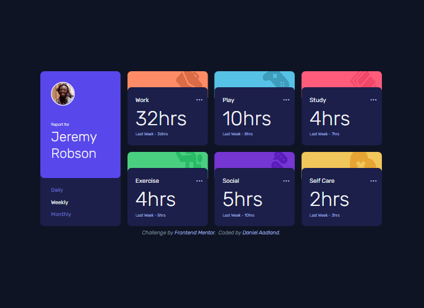

# Frontend Mentor - Time tracking dashboard solution

This is a solution to the [Time tracking dashboard challenge on Frontend Mentor](https://www.frontendmentor.io/challenges/time-tracking-dashboard-UIQ7167Jw). Frontend Mentor challenges help you improve your coding skills by building realistic projects. 

## Table of contents

- [Overview](#overview)
  - [The challenge](#the-challenge)
  - [Screenshot](#screenshot)
  - [Links](#links)
- [My process](#my-process)
  - [Built with](#built-with)
  - [What I learned](#what-i-learned)
  - [Continued development](#continued-development)
  - [Useful resources](#useful-resources)
- [Author](#author)

## Overview

### The challenge

Users should be able to:

- View the optimal layout for the site depending on their device's screen size
- See hover states for all interactive elements on the page
- Switch between viewing Daily, Weekly, and Monthly stats

### Screenshot

### Links

- Solution URL: [Add solution URL here](https://your-solution-url.com)
- Live Site URL: [Add live site URL here](https://your-live-site-url.com)

## My process

### Built with

- Semantic HTML5 markup
- CSS custom properties
- Flexbox
- CSS Grid
- Mobile-first workflow
- [React](https://reactjs.org/) - JS library
- [Next.js](https://nextjs.org/) - React framework
- [TailwindCSS](https://tailwindcss.com/) - CSS Framework

### What I learned

I struggled at quite a few points in this project.

First, I had a lot of trouble getting the svgs positioned so that the main purple div of each TrackingCard would overlap them. I also had trouble sizing them in a way that would avoid deforming them and could also be reused as part of a component. A lot of the svgs still look pretty wonky.

The other main pain point was after setting up the mobile and desktop views, making sure that the design still looked passable at every width inbetween. I used quite a few custom breakpoints, but in retrospect I should have probably made more use of the lg and xl breakpoints that come with Tailwind. 

### Continued development

While looking up solutions to problems I was running into, I found many people were dissatisfied with how Next.js's `<Image />` component deals with svgs, so I'll probably want to explore different ways to deal with svgs in the future. 

I've also got quite a few snippits of code that might be too janky (like using ternary operators to assign classes to the Daily Weekly and Monthly selectors), so I'll probably want to research best practices in React and read others' code to see how I can make mine more clean and legible. 

### Useful resources

- [CSS Grid Cheat Sheet](https://css-tricks.com/snippets/css/complete-guide-grid/) - I haven't gained as much experience with grid as I have with flexbox, so having a cheatsheet to remember what each property does is useful. 

## Author

- Website - [Daniel Aadland]()
- Frontend Mentor - [@GreenCitrus6](https://www.frontendmentor.io/profile/GreenCitrus6)
